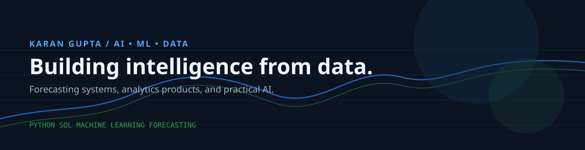
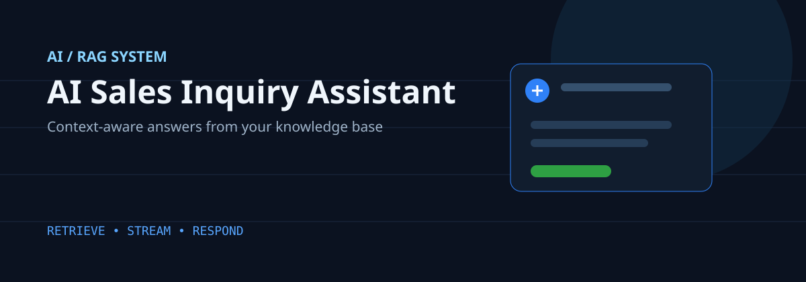
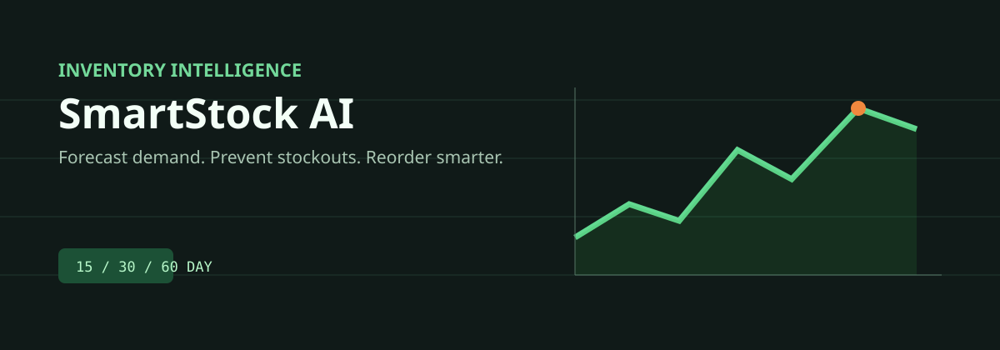
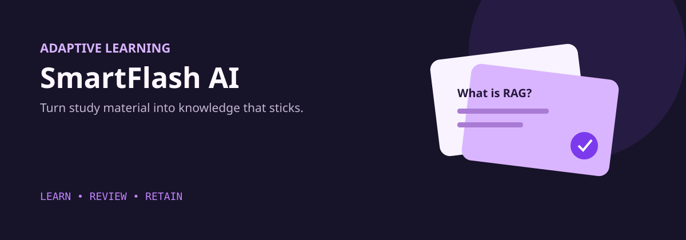
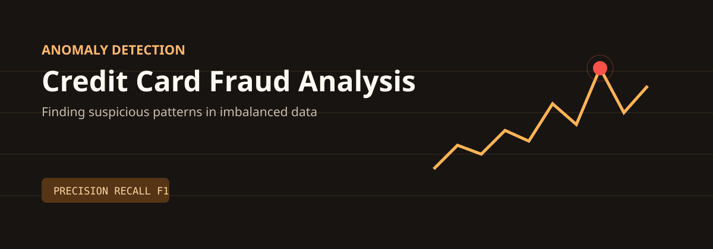
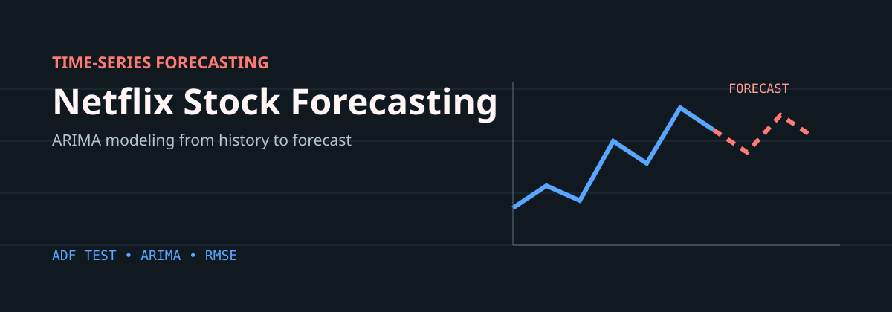
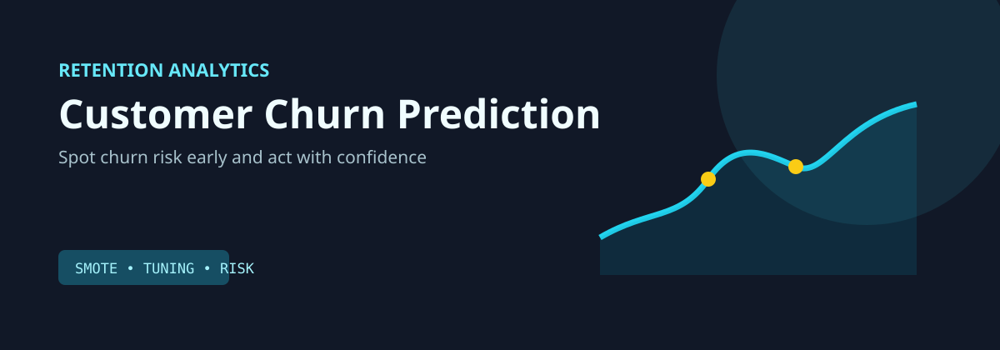

# Karan Gupta

### AI/ML and Data Science Practitioner

 

I build Python-based data and machine learning solutions that turn historical data into useful insights. My current focus is on predictive analytics, time-series forecasting, and practical applications of artificial intelligence.

- Building projects with Python, SQL, and scikit-learn
- Exploring inventory-demand forecasting and business analytics
- Learning deep learning, generative AI, and model optimization
- Interested in creating reproducible, production-ready ML applications

## Core Stack

## Technical Skills

**Languages**

**Data Science and Visualization**

Data cleaning, exploratory data analysis, statistical analysis, data visualization, and feature engineering.

**Machine Learning**

Regression, classification, clustering, model evaluation, predictive analytics, time-series forecasting, and ARIMA.

**Tools**

## Currently Building

| Focus | What I am exploring |
| --- | --- |
| AI products | RAG assistants, document intelligence, and responsive AI interfaces |
| Forecasting | Inventory demand, stockout risk, and time-series evaluation |
| Data science | Imbalanced classification, model comparison, and actionable analytics |
| Learning | Deep learning, generative AI, and production ML practices |

## Featured Projects

<table>
<tr>
<td width="50%" valign="top">

### AI Sales Inquiry Assistant

An AI-powered B2B sales assistant that retrieves knowledge from uploaded documents and streams contextual responses with persistent chat history.

`React` `TypeScript` `Supabase` `PostgreSQL` `RAG`

<a href="https://github.com/KaranGupta143/ai-sales-inquiry-assistant">View repository</a>

</td>
<td width="50%" valign="top">

### SmartStock AI

An inventory intelligence platform for demand forecasting, stockout-risk detection, reorder recommendations, and interactive reporting across 15, 30, and 60-day horizons.

`React` `TypeScript` `Vite` `Tailwind CSS` `Recharts`

<a href="https://github.com/KaranGupta143/ai-inventory-forecasting-system">View repository</a>

</td>
</tr>
<tr>
<td width="50%" valign="top">

### SmartFlash AI

An adaptive learning platform that transforms PDFs into intelligent flashcards and uses spaced repetition to improve long-term retention.

`GPT-4o` `TypeScript` `Next.js` `SM-2`

<a href="https://github.com/KaranGupta143/SmartFlash-AI">View repository</a>

</td>
<td width="50%" valign="top">

### Credit Card Fraud Analysis

A classification project for detecting fraudulent transactions in an imbalanced dataset using evaluation metrics, confusion matrices, and feature importance.

`Python` `Pandas` `Scikit-learn` `Random Forest`

<a href="https://github.com/KaranGupta143/credit-card-fraud-analysis">View repository</a>

</td>
</tr>
<tr>
<td width="50%" valign="top">

### Netflix Stock Price Forecasting

An ARIMA time-series project covering stationarity testing, differencing, model selection, RMSE evaluation, and future adjusted-close-price forecasting.

`Python` `Pandas` `Statsmodels` `Scikit-learn` `ARIMA`

<a href="https://github.com/KaranGupta143/Netflix-Stock-Price-Forecasting-with-ARIMA">View repository</a>

</td>
<td width="50%" valign="top">

### Customer Churn Prediction

An end-to-end ML workflow that uses EDA, SMOTE, model comparison, and hyperparameter tuning to identify customers who may need proactive retention strategies.

`Python` `Pandas` `Scikit-learn` `SMOTE` `GridSearchCV`

<a href="https://github.com/KaranGupta143/Customer_Churn-ML">View repository</a>

</td>
</tr>
</table>

## Currently Learning

- Advanced machine learning and model optimization
- Deep learning and generative AI
- Time-series forecasting
- Statistics for machine learning
- Production practices for reliable ML applications

## 2026 Goals

- Build impactful and reproducible AI/ML projects
- Strengthen data science and analytics skills
- Contribute to open-source projects
- Develop production-ready machine learning applications
- Share clear documentation and measurable project results

## GitHub Activity

 

## Contribution Graph

## Connect

- Email: [ikarangupta75@gmail.com](mailto:ikarangupta75@gmail.com)
- LinkedIn: [linkedin.com/in/karangupta13](https://www.linkedin.com/in/karangupta13/)
- GitHub: [github.com/KaranGupta143](https://github.com/KaranGupta143)

## A Guiding Principle

> The goal is not just to build models, but to build solutions that create real-world impact.

Thanks for visiting. Explore the repositories below to see what I am building and learning.
